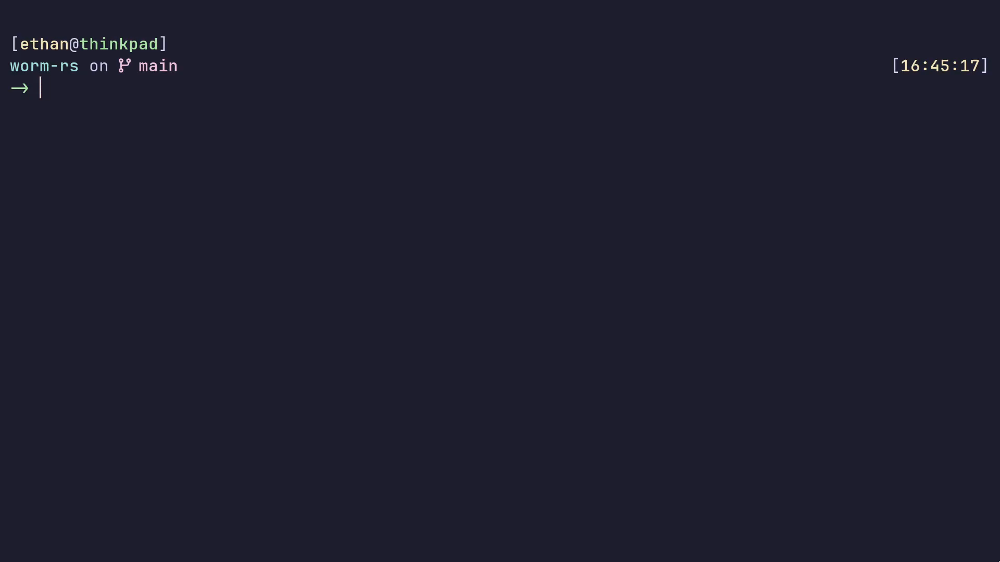

This is a simple implementation of the classic game *worm* in rust.

I wrote it mostly to learn the basics of rust.

## Demo


## Usage
```
Usage: worm-rs [OPTIONS]

Options:
  -f, --fruit-count <FRUIT_COUNT>  Number of fruit [default: 5]
  -w, --worm-length <WORM_LENGTH>  Starting length of the worm [default: 4]
  -s, --stats                      Print stats about render speed on exit
  -h, --help                       Print help
  -V, --version                    Print version
```
